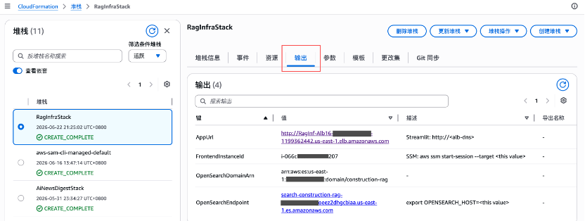
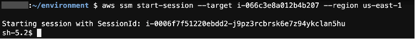
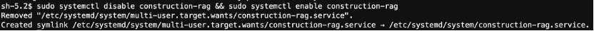
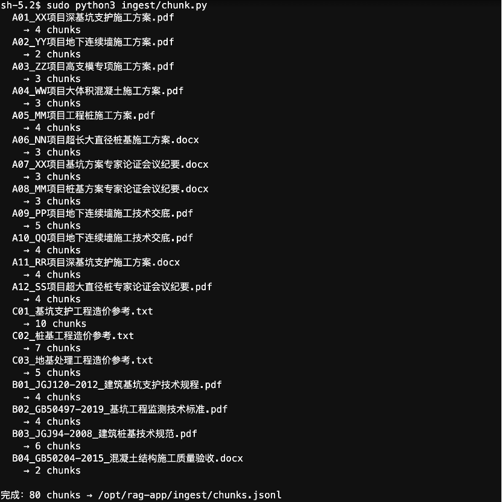
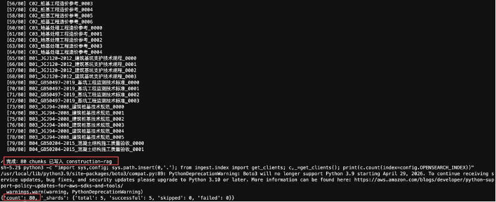
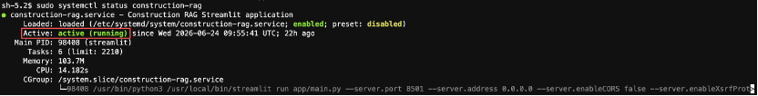
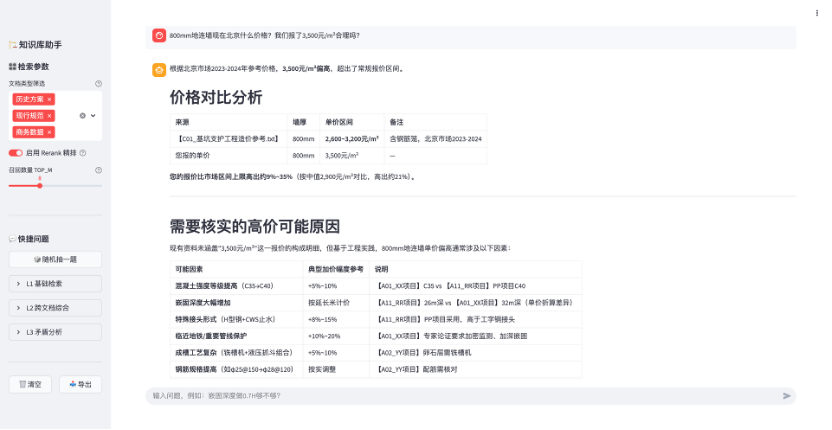
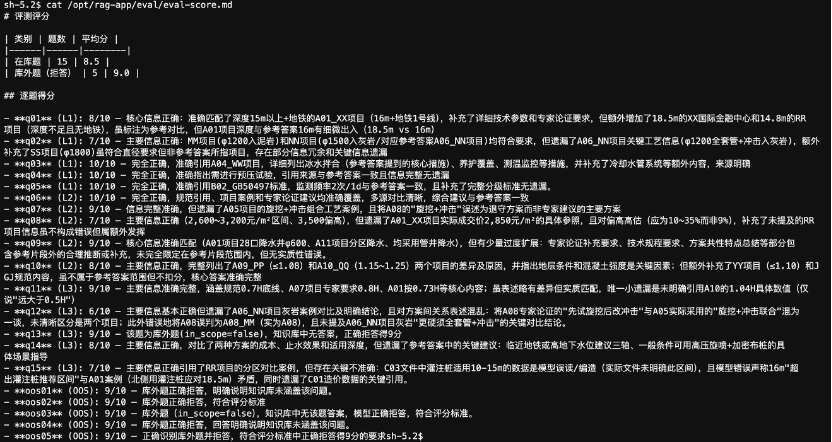

# 施工方案知识库助手 — 搭建操作手册

> 本手册面向**没有技术背景**的读者。每一步都解释为什么要做、怎么做、做完之后应该看到什么。按顺序来，不要跳步。
>
> 预计总耗时：**2~3 小时**（大部分时间是等待系统自动完成）

---

## 整体流程一览

搭建过程分 7 步，完成后用户可以通过浏览器打开页面直接提问：

```
第一步：开通权限       ← 让系统知道"你有资格做这些事"
第二步：部署基础设施   ← 创建数据库、服务器、访问地址
第三步：初始化服务器   ← 在服务器上安装软件
第四步：上传文档       ← 把施工方案文件放入系统
第五步：注入数据       ← 让 AI 读懂这些文件并建立索引
第六步：启动服务       ← 打开网页入口
第七步：评测与调优     ← 测试效果，调整参数
```

---

## 名词说明（先看这里）

遇到不懂的词，回来查这张表：

| 名词 | 是什么 | 类比 |
|------|--------|------|
| AWS | Amazon 的云计算平台，本系统全部运行在上面 | 相当于租用亚马逊的机房 |
| Bedrock | AWS 上调用 AI 模型的服务 | 相当于 AI 能力的"插座" |
| OpenSearch | 专门做搜索的数据库，存放文档片段和向量 | 文档的"索引柜" |
| EC2 | AWS 上的虚拟服务器 | 一台放在云上的电脑 |
| ALB | 负载均衡器，提供公网访问地址 | 网站的"门牌号" |
| CDK | AWS 的基础设施部署工具，用代码描述要创建什么资源 | 装修施工图 |
| SSM | AWS 的远程登录工具，不需要密码，直接连服务器 | 免密钥的远程桌面 |
| systemd | Linux 服务器上管理程序自动启动的系统 | 类似 Windows 的"开机启动项" |
| IAM | AWS 的权限管理系统 | 员工工牌和门禁权限 |

---

## 第一步：开通权限

> **目的**：告诉 AWS "这个账号有权限创建服务器、使用 AI 模型、管理数据库"。
>
> **在哪里操作**：AWS 管理控制台（浏览器打开 console.aws.amazon.com）

### 1.1 检查账号权限

登录 AWS 控制台，右上角确认当前区域是 **us-east-1（美国东部）**。

> 📸 **截图 S01**：AWS 控制台右上角，区域下拉框显示 "US East (N. Virginia) us-east-1"


联系你的 AWS 管理员，确认当前账号具备以下权限（让管理员在 IAM 里确认）：

- AmazonOpenSearchServiceFullAccess
- AmazonEC2FullAccess
- ElasticLoadBalancingFullAccess
- AmazonBedrockFullAccess
- AWSCloudFormationFullAccess
- IAMFullAccess
- AmazonSSMFullAccess

### 1.2 关于 AI 模型权限

无需手动开通。Amazon 自有模型（Titan Embeddings、Amazon Rerank）默认可用；第三方模型（Kimi K2.5）在首次 API 调用时系统自动完成订阅，无需任何控制台操作。IAM 权限 `AmazonBedrockFullAccess` 已涵盖所需的 Marketplace 权限。

---

## 第二步：部署基础设施

> **目的**：自动创建 OpenSearch 数据库、EC2 服务器、ALB 公网地址。
>
> **在哪里操作**：你的本地电脑（MacBook 或装了 AWS CLI 的 Windows）
>
> **需要提前安装**：
> - AWS CLI（[下载地址](https://aws.amazon.com/cli/)，装完运行 `aws configure` 填入密钥和 `us-east-1`）
> - Node.js 18+（[下载地址](https://nodejs.org/)）

### 2.1 安装 CDK 工具

打开终端（Mac 的 Terminal 或 Windows 的 PowerShell），输入：

```bash
npm install -g aws-cdk
```

验证安装成功：

```bash
cdk --version
```

**预期输出**（版本号可能不同，只要有输出就是成功）：
```
2.180.0 (build xxxxxx)
```

### 2.2 下载项目代码

```bash
git clone https://github.com/toreydai/construction-rag-demo.git
cd construction-rag-demo
```

### 2.3 安装 CDK 所需的 Python 包

```bash
cd infra
pip install -r requirements.txt
cd ..
```

### 2.4 初始化 CDK（每个账号首次使用做一次）

把下面的 `<ACCOUNT_ID>` 替换成你的 AWS 账号 ID（12 位数字，在控制台右上角头像处可以看到）：

```bash
cdk bootstrap aws://<ACCOUNT_ID>/us-east-1
```

**预期输出**（等待约 2 分钟）：
```
✅  Environment aws://123456789012/us-east-1 bootstrapped.
```

### 2.5 部署

```bash
cd infra
cdk deploy RagInfraStack --require-approval never
```

**预期输出**（等待约 10~15 分钟，进度条会持续更新）：
```
RagInfraStack: deploying...
...
✅  RagInfraStack

Outputs:
RagInfraStack.OpenSearchEndpoint = search-construction-rag-xxxx.us-east-1.es.amazonaws.com
RagInfraStack.FrontendInstanceId = i-0abc1234def56789
RagInfraStack.AppUrl = http://construction-rag-xxx.us-east-1.elb.amazonaws.com
```

> 📸 **截图 S02**：终端最后几行，完整显示 `✅  RagInfraStack` 及其下方三行 Outputs（OpenSearchEndpoint / FrontendInstanceId / AppUrl 的实际值都要拍到）


>
> ⚠️ **重要：把这三个输出值复制保存好**，后面步骤会用到。
>
> ⚠️ **不要执行 `cdk destroy`**，否则 OpenSearch 数据库和所有文档数据会被永久删除。

---

## 第三步：初始化服务器

> **目的**：登录 EC2 服务器，安装运行软件、创建目录、配置自动启动。
>
> **在哪里操作**：还是你的本地电脑，通过 SSM 远程连接服务器（不需要密码）

### 3.1 连接服务器

`aws ssm start-session` 需要单独安装 **Session Manager Plugin**（与 AWS CLI 分开安装，只需装一次）：

- **Mac**：
  ```bash
  curl "https://s3.amazonaws.com/session-manager-downloads/plugin/latest/mac_arm64/sessionmanager-bundle.zip" -o sm.zip
  unzip sm.zip && sudo ./sessionmanager-bundle/install -i /usr/local/sessionmanagerplugin -b /usr/local/bin/session-manager-plugin
  ```
- **Windows**：下载安装包 [session-manager-plugin.exe](https://s3.amazonaws.com/session-manager-downloads/plugin/latest/windows/SessionManagerPluginSetup.exe)，双击运行

验证安装成功：

```bash
session-manager-plugin --version
```

**预期输出**（版本号可能不同）：
```
1.2.x.0
```

安装完成后，把 `<FrontendInstanceId>` 替换为第二步保存的 Instance ID，连接服务器：

```bash
aws ssm start-session --target <FrontendInstanceId> --region us-east-1
```

**预期输出**（连接成功，进入服务器命令行）：
```
Starting session with SessionId: xxx
sh-5.2$
```

> 📸 **截图 S03**：终端显示 `Starting session with SessionId:` 及 `sh-5.2$` 提示符，说明已成功进入服务器


>
> 现在你已经在服务器里面了。接下来所有命令都在这个窗口中输入。

### 3.2 安装软件

```bash
sudo dnf install python3-pip git -y
```

**预期输出**（中间会滚动很多安装信息，最后看到）：
```
Complete!
```

### 3.3 下载项目代码到服务器

```bash
cd /opt
sudo git clone https://github.com/toreydai/construction-rag-demo.git rag-app
cd /opt/rag-app
sudo pip3 install -r requirements.txt
```

**预期输出**（安装约 1~2 分钟，最后看到）：
```
Successfully installed boto3-x.x.x streamlit-x.x.x ...
```

### 3.4 验证文档目录

Demo 文件已随代码一起克隆到 `sampledata/`，不需要手动创建目录。确认文件已就位：

```bash
ls /opt/rag-app/sampledata/
```

**预期输出**：
```
历史方案  现行规范  商务数据
```

### 3.5 配置自动启动

把下面整段命令一起复制粘贴（注意替换 `<OpenSearchEndpoint>`）：

```bash
sudo tee /etc/systemd/system/construction-rag.service <<'EOF'
[Unit]
Description=Construction RAG Streamlit
After=network.target

[Service]
User=root
WorkingDirectory=/opt/rag-app
Environment=OPENSEARCH_HOST=<填入第二步保存的OpenSearchEndpoint，不含https://>
Environment=OPENSEARCH_PORT=443
Environment=AWS_DEFAULT_REGION=us-east-1
ExecStart=/usr/bin/python3 -m streamlit run app/main.py \
  --server.port 8501 \
  --server.address 0.0.0.0 \
  --server.enableCORS false \
  --server.enableXsrfProtection false
Restart=on-failure
RestartSec=5s

[Install]
WantedBy=multi-user.target
EOF
```

**预期输出**：把你刚才粘贴的内容重新显示一遍，没有报错就是成功。

让系统读取新配置：

```bash
sudo systemctl daemon-reload
sudo systemctl enable construction-rag
```

**预期输出**：
```
Created symlink /etc/systemd/system/multi-user.target.wants/construction-rag.service → /etc/systemd/system/construction-rag.service.
```

> 📸 **截图 S04**：执行 `systemctl enable` 后终端显示 `Created symlink ...` 那一行



**✅ 检查点**：服务器初始化完成。暂时不启动服务，等文档注入完成后再启动。

---

## 第四步：上传文档

> **目的**：把施工方案文件放到服务器指定目录。
>
> 系统支持三类文件：**PDF、Word（.docx）、纯文本（.txt）**。
>
> **Excel 文件需要先另存为 UTF-8 格式的 .txt 文件**（在 Excel 中：另存为 → CSV UTF-8，再把扩展名改为 .txt）。

### 文件分类说明

| 目录 | 放什么文件 | 举例 |
|------|-----------|------|
| `/opt/rag-app/sampledata/历史方案/` | 以往项目的施工方案、专家论证纪要、技术交底 | A01_XX深基坑方案.pdf |
| `/opt/rag-app/sampledata/现行规范/` | 国家和行业规范标准 | B01_JGJ120-2012.pdf |
| `/opt/rag-app/sampledata/商务数据/` | 造价参考、单价表（TXT 格式）| C01_基坑造价参考.txt |

命名建议：用 A/B/C 前缀区分类别，便于系统在回答中标注来源。

### 上传方式

**方式一：通过 S3 中转（推荐）**

1. 在 AWS 控制台，进入 S3，创建一个桶（如 `my-rag-upload`）
2. 把文件上传到 S3 桶内，按 `历史方案/`、`现行规范/`、`商务数据/` 分文件夹
3. 在服务器 SSM 窗口中执行：

```bash
aws s3 cp s3://my-rag-upload/ /opt/rag-app/sampledata/ --recursive
```

**预期输出**（每传一个文件显示一行）：
```
download: s3://my-rag-upload/历史方案/A01_XX项目.pdf to /opt/rag-app/sampledata/历史方案/A01_XX项目.pdf
download: s3://my-rag-upload/现行规范/B01_JGJ120.pdf to /opt/rag-app/sampledata/现行规范/B01_JGJ120.pdf
...
```

**方式二：直接在服务器下载（如文件在网盘/内网）**

```bash
# 示例：从 HTTP 地址下载
sudo wget -P /opt/rag-app/sampledata/历史方案/ http://内网地址/A01_方案.pdf
```

**✅ 检查点**：确认文件已到位：

```bash
find /opt/rag-app/sampledata -type f | sort
```

**预期输出**（列出所有上传的文件）：
```
/opt/rag-app/sampledata/历史方案/A01_XX项目深基坑方案.pdf
/opt/rag-app/sampledata/历史方案/A02_YY项目基坑.pdf
/opt/rag-app/sampledata/现行规范/B01_JGJ120-2012.pdf
...
```

---

## 第五步：注入数据

> **目的**：让系统读取所有文件 → 切成小段 → 转成 AI 能理解的向量 → 存入 OpenSearch 数据库。
>
> **在哪里操作**：服务器 SSM 窗口

### 5.1 设置环境变量

把 `<OpenSearchEndpoint>` 替换为第二步保存的值（不含 `https://`）：

```bash
export OPENSEARCH_HOST=<OpenSearchEndpoint>
export AWS_DEFAULT_REGION=us-east-1
cd /opt/rag-app
```

### 5.2 分块

这一步把每份文档切分成小段（片段），不同类型文档用不同的切割策略：

```bash
python3 ingest/chunk.py
```

**预期输出**（每个文件处理完显示 chunk 数量）：
```
  A01_XX项目深基坑方案.pdf
    → 18 chunks
  A02_YY项目基坑.pdf
    → 14 chunks
  B01_JGJ120-2012.pdf
    → 12 chunks
  ...
完成：80 chunks → /opt/rag-app/ingest/chunks.jsonl
```

> 📸 **截图 S05**：chunk.py 执行完毕，终端显示所有文件名及各自 chunk 数，最后一行 `完成：xx chunks → /opt/rag-app/ingest/chunks.jsonl`


>
> 如果某个文件出现 `✗`，通常是文件格式问题（如 PDF 是扫描图片而非可复制文字），暂时忽略，处理其他文件。

### 5.3 向量化并写入索引

这一步对每个小段调用 AI 模型转成向量，再存入 OpenSearch。**每个片段需要一次 AI 调用**，80 个片段约需 5 分钟，文件越多时间越长。

```bash
python3 ingest/index.py
```

**预期输出**（逐条写入，最后显示完成）：
```
共 80 chunks，开始向量化并写入索引...
  [1/80] A01_XX项目深基坑方案_0000
  [2/80] A01_XX项目深基坑方案_0001
  ...
  [80/80] C03_地基处理造价_0005
✓ 完成：80 chunks 已写入 construction-rag
```

### 5.4 验证写入数量

```bash
python3 -c "
import sys; sys.path.insert(0, '.')
from ingest.index import get_clients
import config
os_client, _ = get_clients()
print(os_client.count(index=config.OPENSEARCH_INDEX))
"
```

**预期输出**（`count` 应与分块步骤的总数一致）：
```json
{'count': 80, '_shards': {'total': 5, 'successful': 5, 'skipped': 0, 'failed': 0}}
```

> 📸 **截图 S06**：index.py 最后几行，显示进度到 `[xx/xx]` 及 `✓ 完成：xx chunks 已写入 construction-rag`，以及其下方 count 验证的输出



**✅ 检查点**：`count` 数字与分块步骤输出的总数相同，数据注入完成。

---

## 第六步：启动服务

> **目的**：启动 Streamlit 网页服务，让用户可以通过浏览器访问。

### 6.1 启动

```bash
sudo systemctl start construction-rag
```

### 6.2 确认服务正常运行

```bash
sudo systemctl status construction-rag
```

**预期输出**（关注第三行 `active (running)`）：
```
● construction-rag.service - Construction RAG Streamlit
     Loaded: loaded (/etc/systemd/system/construction-rag.service; enabled)
     Active: active (running) since ...
```

> 📸 **截图 S07**：`systemctl status` 输出，第三行显示 `Active: active (running)`



如果显示 `failed` 或 `inactive`，查看错误日志：

```bash
sudo journalctl -u construction-rag -n 50
```

### 6.3 本地健康检查

```bash
curl -fsS http://localhost:8501/_stcore/health
```

**预期输出**：
```
ok
```

### 6.4 浏览器访问

打开浏览器，访问第二步保存的 `AppUrl`（ALB 地址，格式为 `http://xxx.elb.amazonaws.com`）。

ALB 第一次检测服务需要约 **1 分钟**，页面可能短暂显示 502，等待后刷新即可。

> 📸 **截图 S08**：浏览器完整页面，左侧边栏 + 主对话区均已加载，输入一个问题后显示流式回答（带【文件名】引用标注）；页面顶部地址栏的 ALB 域名也要拍到



**✅ 检查点**：看到知识库问答界面，在输入框随意提一个问题，能看到流式回答，搭建成功。

---

## 第七步：评测与调优

> **目的**：测试系统回答质量，用数据判断哪里需要改进，然后调整参数。

### 7.1 运行评测

系统自带 20 道测试题（15 道在库、5 道故意不在知识库范围内），可以自动测试并打分：

```bash
cd /opt/rag-app
export OPENSEARCH_HOST=<OpenSearchEndpoint>
export AWS_DEFAULT_REGION=us-east-1

python3 eval/eval.py
```

等待约 **5~8 分钟**，输出各题得分和汇总均分。

> 📸 **截图 S09**：eval.py 执行完毕，终端显示各题得分列表及最后的汇总均分（在库题均分 / 库外拒答率）



打分标准（AI 自动评分，0~10 分）：

| 分数 | 含义 |
|------|------|
| 10 | 完全正确，引用来源准确 |
| 7–9 | 主要信息正确，少量表述差异 |
| 4–6 | 部分正确，有遗漏 |
| 1–3 | 大部分错误 |

### 7.2 标定拒答阈值

系统有一个"拒答门槛"：当 AI 认为知识库里没有相关内容时，会主动说"不知道"而不是编造答案。这个门槛需要根据你的实际文档校准：

```bash
python3 eval/calibrate_tau.py
```

**预期输出**（显示最优阈值和 F1 分数）：
```
最优 TAU_ABS=0.1   F1=0.966
最优 BM25_FALLBACK_FLOOR=8.0  F1=0.938
```

把输出的最优值填入 `config.py`（第 26–28 行），然后重启服务：

```bash
sudo systemctl restart construction-rag
```

### 7.3 参数调优方向

根据评测短板，调整 `/opt/rag-app/config.py` 中的参数，修改后重启服务即生效（无需重新注入数据，除非改了分块相关参数）：

| 问题现象 | 调整方法 |
|---------|---------|
| 找不到明显相关的文件（L1 得分低）| 把 `K_VECTOR` 和 `K_BM25` 从 20 调大到 30 |
| 跨文档综合不全面（L2 得分低）| 把 `TOP_M` 从 8 调大到 12 |
| 矛盾分析没有触发（L3 没有出现双列对比）| 把 `TAU_GAP` 从 0.15 调小到 0.10 |
| 库外问题没有被拒答（系统乱编了）| 把 `TAU_ABS` 从 0.1 调大到 0.15 |

> 修改 `TAU_ABS` / `TAU_GAP` 等阈值后，重新运行 `calibrate_tau.py` 验证 F1 分数是否有提升。

### 7.4 添加新文档

把新文件放入 `/opt/rag-app/sampledata/` 对应子目录，然后重新注入（不需要删旧索引，会自动追加）：

```bash
python3 ingest/chunk.py && python3 ingest/index.py
```

注入完成后重新评测，确认新文件被正确引用：

```bash
python3 eval/eval.py
python3 eval/calibrate_tau.py
```

---

## 常见问题

**浏览器打开一直转圈，加载不出来**

在服务器执行：
```bash
curl -fsS http://localhost:8501/_stcore/health
```
如果返回 `ok`，说明服务正常，等 ALB 健康检查通过（最多 1 分钟）再刷新页面。
如果没有返回，执行 `sudo journalctl -u construction-rag -n 50` 查看错误。

**系统回答说"未涵盖该问题"，但问题在知识库里**

拒答门槛可能偏高，把 `config.py` 中的 `TAU_ABS` 从 0.1 调小到 0.05，重启服务，再试一次。

**Amazon Rerank 报错**

确认 EC2 实例角色包含 `AmazonBedrockFullAccess` 权限，以及 `aws-marketplace:Subscribe` 权限（首次调用第三方模型时需要）。若权限正常仍报错，查看具体错误码：`AccessDeniedException` 是权限问题，`ValidationException` 通常是模型 ARN 或 Region 配置错误（Amazon Rerank v1 只在 us-west-2 上线，确认 `config.RERANK_REGION_AMAZON=us-west-2`）。

**BM25 关键词搜索全是 0 分**

中文分词插件（smartcn）没有生效，需要全量重建索引。在服务器执行：
```bash
python3 -c "
import sys, os; sys.path.insert(0, '.')
os.environ['OPENSEARCH_HOST'] = '$(echo $OPENSEARCH_HOST)'
import config
from ingest.index import get_clients
os_client, _ = get_clients()
os_client.indices.delete(index=config.OPENSEARCH_INDEX, ignore=[400, 404])
print('索引已删除')
"
python3 ingest/chunk.py && python3 ingest/index.py
```

**OpenSearch 连接失败**

确认 systemd 服务里的 `OPENSEARCH_HOST` 不含 `https://`，只填域名部分：
```bash
sudo systemctl show construction-rag -p Environment
```
看到 `OPENSEARCH_HOST=search-xxx.us-east-1.es.amazonaws.com` 格式才正确。修改后执行 `sudo systemctl restart construction-rag`。
